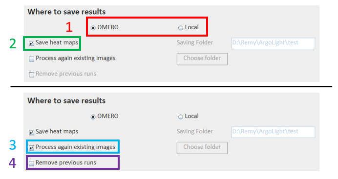

# Metrology using ArgoLight Slides

A Fiji plugin measuring objective-related metrics on images using the OMERO database.

A grid of rings from ArgoLight LM slides is imaged with different objectives, at different zoom factor.
Images are first uploaded on OMERO. Each image is processed locally ; three metrics are computed on each ring : 
field uniformity, field distortion and full width at half maximum. Results are finally sent back to OMERO as key-value pairs,
tags and OMERO.table.

It is also possible to have your images on a local computer. In that case, you don't have the possibitiy to use the benefits of OMERO.
Results are automatically saved locally.

## Installation
- Activate the update sites **OMERO 5.5-5.6** and **PTBIOP** (On Fiji, go on `Help -> Update...`, then click on `Manage Update sites`)
- Restart Fiji

Remarque : the plugin works with [simple-omero-client](https://github.com/GReD-Clermont/simple-omero-client) API (v5.19.0 or later).

## Requirements

- Your slide should be an ArgoLight Slide. The slide must contain the field-of-rings patterns because it is the one used for the analysis.
- 2 different type of images are expected :
  - One image with pixel size = 200 nm, centered on the middle cross, with minimal rotation, to catch the entire objective FoV (preferentially at zoom factor = 1). It corresponds to the fullFoV image. This image is used to compute field distortion and field uniformity.
  - One image with pixel size = 60 nm, centered on the middle cross, with minimal rotation, to be able to measure the FWHM. It corresponds to the partialFoV image. This image is used to compute FWHM.

  

### For images on OMERO
- Your images should be separated according to the microscope used (i.e. one dataset or one project per microscope). All the datasets should be located under the same project.
- The name of the dataset/project must contain the name of the microscope

  

- Images have to be named according the following structure
  - For fileset images
    - *microscopeName*\_*ArgoSlideName*\_*patternImaged*\_**d***AcquisitionDate*\_**o***Objective*\_*ImmersionMedium*.extension [*FOV*\_*Serie*]
    - Exemple : sp8int1_ArgoSGL482_b_d20230420_o20x_dry.lif [partialFoV_Image007]

  - For inividual images
    - *microscopeName*\_*ArgoSlideName*\_*patternImaged*\_**d***AcquisitionDate*\_**o***Objective*\_*ImmersionMedium*\_*FOV*\_*Serie*.extension
    - Exemple : lsm980_ArgoSGL482_b_d20230420_o20x_dry_fullFoV_Image002.czi

  - Be careful : the FOV item has to be either **fullFoV** or **partialFoV** or **fixedFoV**. For the last one, all metrics are computed on the same image. It is particularly convienant for widefield microscopes, without any solution to zoom in.

### For images on local computers
- Your images should be separated according to the microscope used (i.e. one dataset per microscope). All the folders should be located under the same parent folder.

  

- Images have to be named according the following structure
  - For fileset images
    - You can acquire on filset per objective (i.e. you don't have to acquire one image per project).
    - *microscopeName*\_*ArgoSlideName*\_*patternImaged*\_**d***AcquisitionDate*\_**o***Objective*\_*ImmersionMedium*.extension - *FOV*\_*Serie*
    - Exemple : sp8int1_ArgoSGL482_b_d20230420_o20x_dry.lif - partialFoV_Image007

  - For inividual images
    - *microscopeName*\_*ArgoSlideName*\_*patternImaged*\_**d***AcquisitionDate*\_**o***Objective*\_*ImmersionMedium*\_*FOV*\_*Serie*.extension
    - Exemple : lsm980_ArgoSGL482_b_d20230420_o20x_dry_fullFoV_Image002.czi

  - Be careful : the FOV item has to be either **fullFoV** or **partialFoV** or **fixedFoV**. For the last one, all metrics are computed on the same image. It is particularly convienant for widefield microscopes, without any solution to zoom in.

## User guide

### Launch the plugin

Launch the plugin by hitting `Plugins -> BIOP -> Argolight analysis tool`

  

### Basic configurations -- To do the first time you use the plugin

This step set the by-default values for input-output communication. These values are saved for your future use of the plugin ; you'll have to do it once.

#### General settings

1. Hit the button `General settings`. 
2. On the popup, enter the host name and port of your OMERO server
3. Enter the list of ArgoSlides you may want to use for the analysis (manually or by browsing a csv file). 
In the csv file, you should have one ArgoSlide by line. If you enter ArgoSlides manually, names must be separated by only comma.

**Be careful : the ArgoSlides' name should be contained (but not case sensitive) in the image name.**

4. Optionnally, and IF you want have your images on a local computer, you can add the folder path where you want to read raw images.
5. Optionnally, and IF you want to save results locally (see below), you can add the folder path where you want to save results.
6. Then, press OK. 

  

#### ArgoSlide settings

1. Choose an ArgoSlide in the list.
2. Hit ``Settings`` button
3. Fill the fields with the ArgoSlide specifications (Distance betwen two rings, pattern FoV, number of rings per line)
4. If you tick the box ``Set as your default slide``, this ArgoSlide will be automatically selected each time you launch the plugin.
5. Then press ``Ok``.

These settings are saved for the selected ArgoSlide. If you have multiple slides, you need to select each slide and apply their respective settings.

  

### Quick start

1. Select the file location
2. If OMERO, enter your gaspar credentials and click on `connect`. If local, enter the path of the parent folder (i.e. raw folder in the above figure). 
3. If OMERO, select whether microscopes are at dataset or project level
    - If at the dataset level, then select the Argolight project
    - If at the project level, then select fist microscope and then the dataset to process
4. Select the microscope you want to process.
5. Select the ArgoSlide you used to take the images.
6. Click OK
7. The current steps / actions performed are logged in the Fiji Log window
8. At the end of the processing, a popup indicates the user that all images within the selected dataset have been processed.

For OMERO location, every images that are not tagged with `raw` tag and with the selected ArgoSlide contained in its name are processed within the selected dataset.
For local location, every images that are not contained in the summary file and with the selected ArgoSlide contained in its name are processed within the selected folder.

### Output location and settings

1. You can choose to save results on OMERO or on your local machine. 

If you choose to save results locally, you are asked to provide the parent folder (equivalent to the OMERO project). This folder may or may not contain microscope sub-folders (they are created in case they do not exist yet). This folder can be defined as default parameter by hitting the button `General settings`.

2. Checking this box will save heat maps of the computed metrics (i.e. field uniformity, field distortion, FWHM).
3. Checking this box will process ALL images within the selected dataset, without any distinction between those that have previously been processed.
4. You can choose, in case you would like to process all images, to remove all results from previous run(s).

  

### Processing settings

A few parameters used for segmentation and analysis can be manually set.
1. Sigma for gaussian blurring -> denoising
2. Median radius for median filtering -> denoising
3. Method to threshold the denoised image -> thresholding
4. Size of the thresholded particules to keep (> value) -> denoising
5. Analyzed area around the ring (for FWHM) -> analysis

If you check the `default` box, then hard-coded default parameters are used.

6. If you check ``Use only once``, the new settings are only used for the current simulation (i.e. the default settings are not overwritten).

  

### Live preview

A live preview mode enable you to set dynamically the processing parameters and to get direct visual feedback of the segmentation results only (the analysis results are not display).
1. Select the file location.
2. If OMERO, enter your gaspar credentials. If local, nothing to do.
3. If OMERO, click on `connect` button. If local, nothing to do.
4. Click on `Live preview` button.

  

5. On the popup, add the OMERO ID of a typical image or the path of the image you want to open
5. Click on `Load`. The image should display in Fiji. the first channel is automatically displayed
6. Each time you modify one parameter, the segmentation result updates
7. When satisfied with the results, click on `OK`. The new parameters will be used for the current simulation.

  

9. Confirm if you want the overwrite default settings by the live settings, or use them in the current simulation or just discard them.

  

## Analysis results

- If the data are coming from OMERO, 9 to 11 tags are linked to the raw image on OMERO, even if results are saved locally : `raw`, `argolight`, `slideName`, `objective`, `immersion`, `microscope`, `pattern`, `FoV` and `individual_metrics`.
- If the data are coming from local computer, the image title (including the serie) is added to the summary file of processed images.
- Processing parameters, as well as ArgoSlide specifications, are saved in the form of key-value pairs.
- Computed metrics are saved as OMERO.table attach to the image and, if specified, in the form of heat maps.

  

- Detected rings, as well as ideal ring positions, are saved as ROIs, grouped by ring type (i.e. ideal or detected).

  

- A per-image summary is finally attached to the parent dataset. It groups relevant information that may be used to follow, in time, the different metrics and therefore assess objective quality. Because not all metrics are computed on all images, `-1` replaces the metric value for image on which this metrics is not computed (ex : `-1` for FWHM on all 200nm pixel size images).

  

In case of local saving, the same outputs are saved in a results folder, with .txt file for the key-value pairs, .csv files for the tables and .zip for ROIs (readable on Fiji).

  

## Monitor data with OMERO.parade

OMERO.parade is a plugin of OMERO.web for data mining. Fields coming from an OMERO.table are read, filtered and displayed as a graph. This plugin is helpful to monitor computed metrics over time.

1. Move your OMERO dataset at the root (i.e. outside any project)

  

2. Select the dataset and switch to `Parade`

  

3. Click on the `graph mode`

  

4. Select different metrics to monitor like `Acquisition date`, `field distortion avg`, `field uniformity avg`...

  

5. Add tag filters for objctives, slide, FoV...
  - For `field distortion` and `field uniformity` metrics, you must filter images with `fullFoV` tag 
  - For `FWHM` metrics, you must filter images with `partialFoV` tag 

  

6. Select `Acquisition date` for the x-axis
7. Select one metrics for the y-axis.

  

8. Each dot represent one image. Clicking on one of them highlights the corresponding image on the left tree and displays annotations/metadata attached on the right. This is particularly useful when you deal with outliers.

